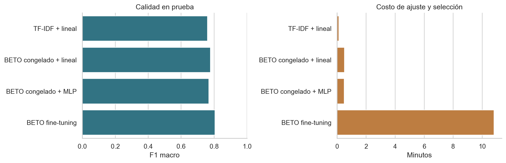

# Entregables de Procesamiento de Lenguaje Natural

**ICESI · Grupo X-Ray**

Ruben Dario Sabogal · Cristian Camilo Quebrada · Edwin Perez L

Repositorio del curso. Esta entrega estudia cómo reconocer la intención de una
solicitud breve en español: crear una alarma, consultar el calendario, reproducir
música y otras acciones. Compara cuatro enfoques sobre las 60 intenciones de
MASSIVE `es-ES`, con EDA, selección por validación, análisis de errores y una demo.

| Entrega | Contenido |
|---|---|
| [Clasificación de intenciones con BETO](clasificacion_intenciones_beto.ipynb) | Notebook completo con código, gráficas, resultados y conclusiones |
| [Resultados](resultados/) | Métricas, predicciones, particiones y gráficas exportadas |

Las próximas actividades pueden incorporarse en carpetas propias con su notebook,
dependencias y documentación, y enlazarse desde este índice.

## Caso y resultados

El objetivo es clasificar la acción solicitada, no responder al usuario ni ejecutar
esa acción. MASSIVE usa solicitudes localizadas al español de España; una prueba
manual con expresiones colombianas ilustra límites de transferencia sin pretender
validar el modelo para toda Colombia.

Resultados de la ejecución entregada; la métrica principal es F1 macro:

| Modelo | Accuracy | F1 macro | F1 ponderado |
|---|---:|---:|---:|
| TF-IDF + regresión logística | 0.7993 | 0.7604 | 0.8013 |
| BETO congelado + capa lineal | 0.8167 | 0.7769 | 0.8168 |
| BETO congelado + MLP | 0.8164 | 0.7685 | 0.8165 |
| BETO fine-tuning | **0.8689** | **0.8048** | **0.8674** |

El modelo se elige por **validación**, sin optimizar con prueba. Prueba contiene
2.974 ejemplos y solo 59 intenciones con soporte: `cooking_query` no está presente.
Por eso F1 macro de prueba promedia esas 59 clases; validación incluye las 60.
Las probabilidades guardadas permiten recalcular las cifras sin cargar BETO.



Con umbral 0,55, elegido en validación, se aceptan 2.787 solicitudes de prueba
(93,71 %), con 90,24 % de aciertos entre las aceptadas. El resto requiere aclaración.
Las puntuaciones no están calibradas y este mecanismo no demuestra detección fuera
de dominio. La MLP tampoco supera a la cabeza lineal en prueba: mayor capacidad
no garantiza mejor resultado con esta configuración.

## Reproducir la entrega

Se recomienda **Python 3.11** y ejecutar los comandos desde la raíz del repositorio.
La instalación verificada usa las versiones de `requirements-lock.txt`.
`requirements.txt` fija las dependencias principales; el lock fija también las
transitivas. La primera ejecución necesita Internet para descargar dependencias,
datos y el checkpoint base. Después puede utilizar los archivos locales.

```bash
git clone https://github.com/cris-bytes/curso-nlp-entregables.git
cd curso-nlp-entregables
python3.11 -m venv .venv
source .venv/bin/activate
python -m pip install -r requirements-lock.txt
python scripts/ejecutar_notebook.py
```

En Windows, activa el entorno con `.venv\Scripts\activate` y usa Python 3.11.
Si el lock de la plataforma original no se resuelve en otro sistema, instala
`requirements.txt` y conserva la nueva versión de `resultados/entorno.json` para
documentar el entorno utilizado. Eso no constituye una reproducción del lock original.

El ejecutor usa un kernel nuevo del Python activo, respeta el orden de las celdas,
guarda las salidas en el notebook y registra `resultados/ejecucion_completa.json`.
`REENTRENAR = True` es el valor entregado: vuelve a ajustar los cuatro enfoques.
Las representaciones congeladas pueden reutilizarse si coincide su clave de caché.
Para recalcularlas también, elimina únicamente los archivos
`.cache/embeddings_*.npz` antes de ejecutar. Si falla alguna celda, el notebook de
diagnóstico queda en `.cache/ejecucion_fallida.ipynb`.

También puedes abrir `jupyter lab`, seleccionar el entorno del proyecto y ejecutar
**Restart Kernel and Run All Cells**. La última sección de demostración permite
cambiar el texto de `clasificar_solicitud(...)` y explorar las tres intenciones más
probables. `REENTRENAR = False` reutiliza modelos locales existentes; no sustituye
la comprobación del entrenamiento completo.

La ejecución verificada usó Apple MPS; el notebook selecciona CUDA,
MPS o CPU automáticamente. El ajuste completo de BETO tomó aproximadamente
10,8 minutos y el notebook completo 12,7 minutos; no es una estimación para otros equipos. Se
necesitan varios GB de espacio para entorno, pesos, caché y checkpoints. La semilla
42 y las versiones fijadas reducen variabilidad, pero no garantizan resultados
idénticos entre dispositivos ni tiempos idénticos entre ejecuciones.

## Archivos y fuentes

```text
clasificacion_intenciones_beto.ipynb   Estudio completo y demo
requirements*.txt                     Dependencias
data/fuentes.json                     Revisiones y SHA-256 de los datos
resultados/                          Evidencia de la ejecución
scripts/                             Ejecutor del notebook
```

`modelos/`, los Parquet originales, los entornos y las cachés se excluyen de Git:
el notebook descarga las fuentes fijadas y vuelve a generar los modelos. Los CSV
de particiones incluidos son derivados de MASSIVE y mantienen su atribución.
En `probabilidades_prueba.npz`, `modelo_0` a `modelo_3` siguen el orden de la tabla
anterior y de `comparacion_prueba.csv`; las columnas siguen `configuracion.json`.

- [MASSIVE, Amazon Science](https://huggingface.co/datasets/AmazonScience/massive),
  licencia [CC BY 4.0](https://creativecommons.org/licenses/by/4.0/).
  Se utiliza el locale `es-ES`, se normalizan claves para detectar duplicados y se
  depuran entrenamiento y validación. Prueba conserva los ejemplos oficiales.
  Revisión: `ed58ac423a2f4121720918bf5301577edce4ffd3`.
- [BETO, Universidad de Chile](https://huggingface.co/dccuchile/bert-base-spanish-wwm-cased).
  Revisión: `c4d86612f51b4f46759c8390d1798c2febe71b93`.
- [Notebook guía de la clase](https://github.com/Ohtar10/icesi-advanced-dl/blob/main/Unidad%203%20-%20Transformers/text-classification-with-hf.ipynb).
  El ejemplo clasifica noticias. Este caso utiliza solicitudes e intenciones de
  MASSIVE e incorpora TF-IDF, auditoría de fugas, mean pooling, curva de datos,
  abstención y pruebas manuales de variación lingüística.
